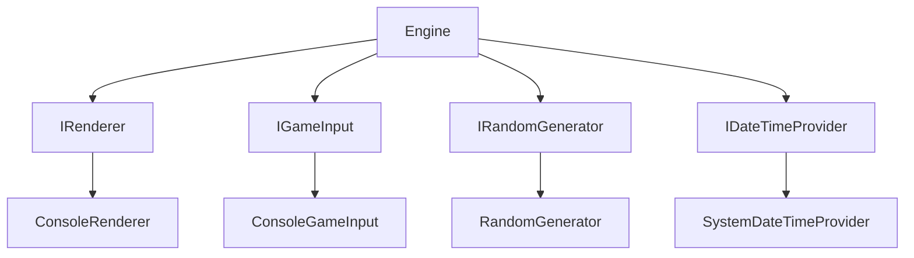
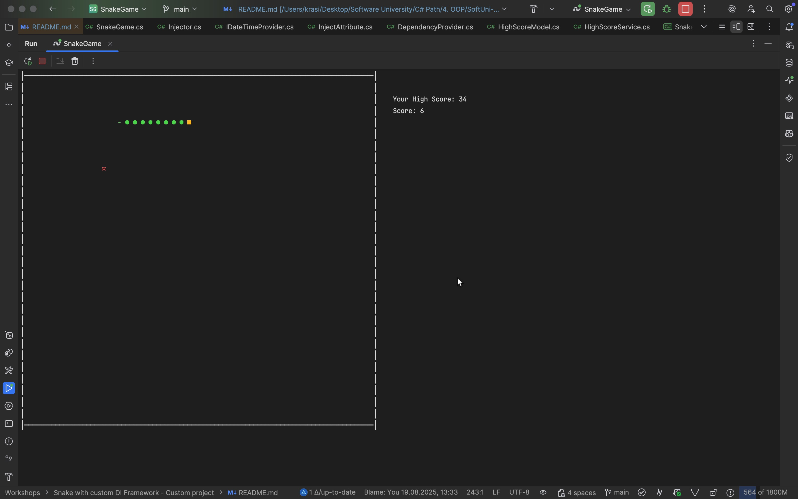

# 🐍 Snake Game with Custom DI Framework

Implementation of the classic Snake game in C#, built on top of a custom-made Dependency Injection framework.

Project: **Snake Game with Custom Dependency Injection Framework** is a console-based implementation of the classic Snake game, built entirely in C#. Besides gameplay, the project showcases a **handcrafted DI container** (EasyInjector) to demonstrate IoC, constructor injection, and attribute-based field injection.

<p align="center">
  
</p>

---

## 💻 **Link to the Source Code**

You can view the source code for this project here:

- **Game entry**: [`SnakeGame.cs`](SnakeGame/SnakeGame/SnakeGame.cs)
- **Engine**: [`Engine.cs`](SnakeGame/SnakeGame/Core/Engine.cs)
- **Renderer**: [`ConsoleRenderer.cs`](SnakeGame/SnakeGame/IO/ConsoleRenderer.cs)
- **Custom DI**: [`DependencyProvider.cs`](SnakeGame/EasyInjector/DependencyProvider.cs), [`Injector.cs`](SnakeGame/EasyInjector/Injector.cs)

---

## 📌 Project Goals

- Implement a playable **Snake** console game in C# / .NET.
- Design and integrate a **custom DI framework** (no external DI libs).
- Practice **clean code**, **modularity**, and **architecture** patterns.
- Persist the **highest score** between sessions in a user-friendly, cross-platform way.

**Game features:**
- Player-controlled snake (arrow keys).
- Randomly spawning food with different point values.
- Collision detection (walls & self).
- Ability for the player to restart or quit after the game ends.
- Live score and persistent **High Score** (JSON storage).

---

## ✅ My Solution

### Gameplay & Rendering
- Efficient console rendering via `Console.SetCursorPosition`.
- Clear separation of **contracts** (interfaces) and **implementations**:
    - `IRenderer` → `ConsoleRenderer`
    - `IGameInput` → `ConsoleGameInput`
    - `IRandomGenerator` → `RandomGenerator`
    - `IDateTimeProvider` → `SystemDateTimeProvider`

### High Score Persistence
- File: `highScore.json`, stored under the user’s **Application Data** directory
    - Windows: `%AppData%\SnakeGame\highScore.json`
    - macOS: `~/Library/Application Support/SnakeGame/highScore.json`
    - Linux: `~/.config/SnakeGame/highScore.json`
- Safe, atomic writes (temporary file + replace), thread-safe `lock`, and in-memory cache.
- Class: `HighScoreService` (uses injected `IDateTimeProvider`).

### DI Integration in `Program.cs`
```csharp
// SnakeGame/SnakeGame.cs
Injector
    .Register<IRenderer, ConsoleRenderer>()
    .Register<IGameInput, ConsoleGameInput>()
    .Register<IRandomGenerator, RandomGenerator>()
    .Register<IDateTimeProvider, SystemDateTimeProvider>()
    .Create<Engine>()
    .Run(); 
```
---

## 📋 Input and Output

**Controls**
- `↑` Up  
- `↓` Down  
- `←` Left  
- `→` Right  
<br>
- `↵ Enter` Restart game
- `␣ Space` Exit game

**Output**
- Live rendering of walls, snake, and food in the console.  
- Real-time score & **High Score**.  
- Game-over screen with optional “New High Score!” indicator when applicable.  

---

## 📊 Solution Design

| Component                                     | Responsibility                                                     |
|-----------------------------------------------|--------------------------------------------------------------------|
| `Core/Engine.cs`                              | Main game loop (update & render), score, collisions                |
| `Models/Snake.cs`                             | Snake body, movement, growth                                       |
| `Models/Food*.cs` (`Star`, `Sun`, `Asterisk`) | Food variants with points & glyphs                                 |
| `IO/ConsoleRenderer.cs`                       | Drawing walls, snake, food, score, messages                        |
| `IO/ConsoleGameInput.cs`                      | Non-blocking key input → `Direction`                               |
| `Utility/HighScoreService.cs`                 | Load/Save persistent high score (JSON)                             |
| `Utility/RandomGenerator.cs`                  | Random numbers for food placement ans food variants                |
| `Contracts/*.cs`                              | `IRenderer`, `IGameInput`, `IRandomGenerator`, `IDateTimeProvider` |
| **DI**: `CustomDIFramework/*`                 | EasyInjector (container, API, attributes, messages)                |

---

## 🔧 Custom DI Framework (EasyInjector)

A lightweight DI framework implemented from scratch in **`EasyInjector`**, designed to be reusable and easily integrated into future projects beyond the Snake Game.

### Main Types
- **`DependencyProvider`**: the container holding registrations & creating instances.
- **`Injector`**: static **fluent entrypoint** to build and chain registrations easily.
- **`InjectAttribute`**: opt-in **field injection** for private instance fields.
- **`Dependency`**: internal wrapper for registrations (instance / type / factory).
- **`Utility/ExceptionMessage`**: centralized error messages.

### Registration API
```csharp
// Generic: interface → implementation (transient)
provider.Register<IService, Service>();

// Generic: interface → instance (singleton-like)
provider.Register<IClock>(new SystemClock());

// Generic: interface → factory (transient via factory)
provider.Register<IRepository, Repository>(p => new Repository(p));

// Non-generic overloads are available too
provider.Register(typeof(IService), typeof(Service));
provider.Register(typeof(IService), new Service());
provider.Register(typeof(IService), (Func<DependencyProvider, object>)(p => new Service()));
```


### Resolution & Object Graph Creation
- **Constructor injection** with **exactly one** public instance constructor:
    - The container inspects the single public constructor, resolves its parameters, and calls it.
    - Each parameter must be **registered**; otherwise throws a clear exception.
- **Field injection** via `[Inject]` on **private instance fields**:
    - After construction, the container scans non-public, non-static instance fields, finds those with `[Inject]`, resolves them, and sets values via reflection.
- **Interfaces**:
    - `Create<T>()` / `Create(Type)`:
        - If `T` is an **interface**, the container **must** have a registration and returns the resolved dependency.
        - If `T` is a **class**, it must have **exactly one** public constructor; DI resolves its parameters recursively.

**Snippet from usage:**
```csharp
var provider = new DependencyProvider();
provider.Register<IRenderer, ConsoleRenderer>()
        .Register<IGameInput, ConsoleGameInput>()
        .Register<IRandomGenerator, RandomGenerator>()
        .Register<IDateTimeProvider, SystemDateTimeProvider>();

var engine = provider.Create<Engine>(); // ctor-injected: IRenderer, IGameInput, IRandomGenerator, IDateTimeProvider
engine.Run();
```
---

### Lifetime Semantics
- **Instance registration** → **singleton-like** (always returns the same object).
- **Type / Factory registration** → **transient** (new instance per resolve).

---

### Validation & Errors (selected)
- Duplicate registration for the same abstraction → **invalid**.
- Resolving unregistered abstractions or dependencies → **invalid** (clear message).
- Classes with 0 or >1 public constructors → **invalid** (explicit errors).

---

### Limitations (by design for learning)
- No scopes / disposal / decorators.
- No cyclic dependency detection (would cause recursion issues).
- One public constructor rule (keeps resolution deterministic & simple).
- Field injection supports **instance private** fields only (no static | no properties).

---

## 📈 Dependency Graph


---

## 🛠️ Technologies Used

- **C# & .NET**
- **System.Text.Json** (serialization for high score)
- **Console API** (rendering)
- **Custom DI (EasyInjector)**

---

## ⚙️ Prerequisites

To run the project locally, you need:

- [.NET SDK 8.0 or later](https://dotnet.microsoft.com/en-us/download)
- Git (to clone the repository)

Verify installation:

```bash

dotnet --version
git --version
```

## 📥 Clone Repository

Clone the project locally:

```bash

git clone https://github.com/krasimirnyv/Snake-Game-with-custom-DI-Framework.git
cd Snake-Game-with-custom-DI-Framework
```

## ▶️ Getting Started

```bash

# from repository root
dotnet build
dotnet run --project SnakeGame/SnakeGame.csproj
```

## 🎮 Gameplay Preview

<p align="center">
  
</p>

---

## 🚀 Try the Demo

You can play the game directly in your web browser here (it doesn't contain the DI container):

<a href="https://replit.com/join/zhsrwocelv-krasimirnyv" target="_blank">
  
</a>

---

## 🧪 Notes & Tips

- On Unix terminals, avoid forcing console window size; prefer reading `Console.WindowWidth/Height`.
- `HighScoreService` uses an injected `IDateTimeProvider` → easy to unit-test with a fake time source.
- The DI container supports factory registrations, so you can wire complex graphs without external libraries.  

---

## 📄 License

This project is licensed under the **MIT License**.

You are free to use, copy, modify, merge, publish, distribute, sublicense, and/or sell copies of the Software, provided that the copyright notice and this permission notice are included in all copies or substantial portions of the Software.

See the [LICENSE](LICENSE) file for the full text.  
